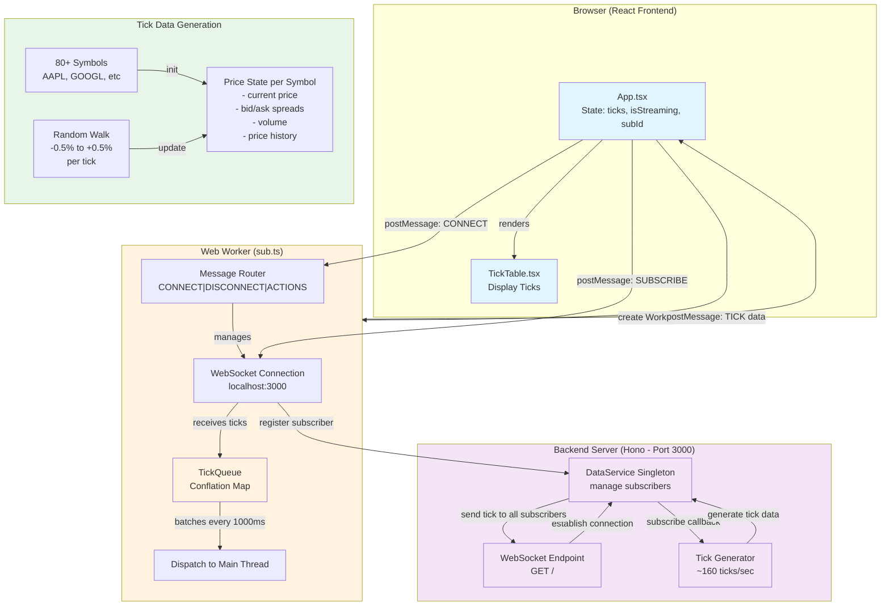
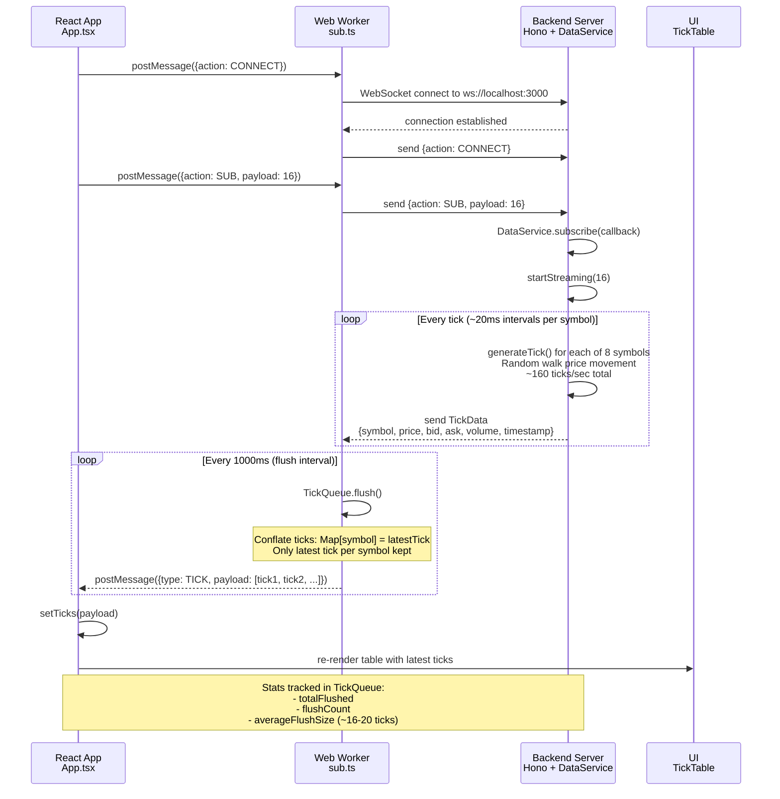
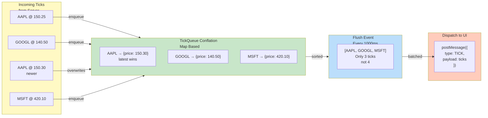

# Trading Tick System

A high-performance React application that demonstrates real-time trading data processing with a production-grade buffer management system, intelligent scheduling, and off-thread processing using SharedWorkers.

## Features

### 1. **Ring Buffer** (`TickBuffer.ts`)
- Memory-efficient circular buffer implementation
- Fixed capacity to prevent unbounded memory growth
- O(1) add and flush operations
- Utilization tracking for monitoring

### 2. **Intelligent Scheduler** (`TickScheduler.ts`)
- Time-based flushing (configurable intervals)
- Size-based flushing (batch thresholds)
- Forced flushing when buffer reaches capacity
- Real-time statistics tracking:
  - Total ticks flushed
  - Flush count and frequency
  - Average flush size
  - Last flush time
  - Buffer utilization percentage

### 3. **Shared Worker** (`tickWorker.ts`)
- Runs tick generation off the main thread
- Simulates high-frequency market data (50ms intervals)
- Multiple message port support for scalability
- Realistic price movements using random walk simulation
- Handles 8 different symbols (AAPL, GOOGL, MSFT, AMZN, TSLA, META, NVDA, AMD)

### 4. **React Integration** (`useTickWorker.ts`)
- Custom React hook for seamless worker integration
- Auto-connect and port management
- Message-driven architecture
- Error handling and state management

### 5. **Interactive UI**
- **Control Panel**: Start/stop and configure system parameters
- **Stats Panel**: Real-time monitoring of buffer metrics
- **Tick Display**: Live table of trading data
- **Symbol Filtering**: Search and filter by trading symbol

## Architecture

### System Overview



### Message Flow



## Key Concepts

### TickQueue Conflation Pattern

The heart of the system is the **conflation pattern** implemented in `TickQueue`, which uses a `Map<symbol, TickData>` for intelligent tick buffering:



**Conflation Benefits:**
- Message volume: 160 ticks/sec → ~20 ticks/sec to UI
- Reduces DOM re-renders by 8x
- Last write wins: only latest price per symbol matters
- O(1) map operations for enqueue
- Memory efficient: fixed conflation map size

### Buffer Management
The conflation map uses last-write-wins semantics:
```typescript
enqueue(tick: TickData): void {
  this.conflationMap.set(tick.symbol, tick);
}
```

When flushing, only the latest tick per symbol is sent to the UI:
```typescript
private flush(): void {
  if (this.conflationMap.size === 0) return;
  
  const ticks = Array.from(this.conflationMap.values())
    .toSorted((a,b) => a.symbol.localeCompare(b.symbol));
  this.conflationMap.clear();
  
  this.dispatch({ type: MSG_TYPES.TICK, payload: ticks });
}
```

### Design Patterns

| Pattern | Implementation | Benefit |
|---------|---|---|
| **Conflation** | Map[symbol] = latestTick | Reduces downstream message load by 8x |
| **Time-based Batching** | 1000ms flush interval | Removes per-tick latency overhead |
| **Singleton** | DataService.getInstance() | Single source of truth for market data |
| **Worker Pattern** | Web Worker isolation | Keeps heavy lifting off main thread |
| **Producer-Consumer** | Server generates, Worker buffers, UI consumes | Decoupled, async data flow |
| **Pub-Sub** | DataService callbacks | Multiple subscribers, single source |

### Performance Characteristics
- **Tick Generation**: 20 ticks/symbol × 8 symbols = ~160 ticks/sec
- **After Conflation**: Only latest tick per symbol (~20 ticks/sec to UI)
- **Flush Frequency**: 1 batched message per second
- **UI Updates**: ~20 rows per update (one per tracked symbol)
- **Memory**: O(1) - fixed conflation map size
- **Latency**: ~1000ms (controlled flush interval)
- **Throughput**: 160 ticks captured, ~20 delivered to UI

## Configuration

The system is highly configurable:

```typescript
interface SchedulerConfig {
  flushInterval: number;    // Time between flushes (10-500ms)
  maxBufferSize: number;    // Ring buffer capacity (100-2000)
  batchSize: number;        // Min ticks before flush (10-500)
}
```

Adjust these values in the Control Panel for different performance characteristics.

## Running the Application

### Development
```bash
bun install
bun run dev
```

Access the app at `http://localhost:5173/`

### Build
```bash
bun run build
```

### Preview
```bash
bun run preview
```

## Use Cases

1. **High-Frequency Trading Systems**: Efficient tick buffering and batch processing
2. **Real-time Analytics**: Stream processing with configurable flushing
3. **IoT Data Collection**: Batch collection and periodic transmission
4. **Event Processing**: Time-windowed and size-windowed aggregation
5. **Market Data Feeds**: Live feeds with intelligent batching

## Learning Points

This project demonstrates:

✅ Ring buffer data structures  
✅ Shared Worker usage in React  
✅ Message-passing architecture  
✅ Scheduler and flushing patterns  
✅ Real-time statistics tracking  
✅ Responsive UI with WebWorkers  
✅ Production-grade error handling  
✅ TypeScript type safety  

## Browser Support

- Chrome/Chromium 79+
- Firefox 79+
- Safari 15.1+
- Edge 79+

SharedWorkers require modern browser support. Check [caniuse.com](https://caniuse.com/sharedworkers) for details.

## Code Organization

```
src/
├── types.ts              # Core type definitions
├── TickBuffer.ts         # Ring buffer implementation
├── TickScheduler.ts      # Scheduler and flusher
├── tickWorker.ts         # SharedWorker script
├── useTickWorker.ts      # React hook
├── ControlPanel.tsx      # Control UI
├── ControlPanel.css
├── StatsPanel.tsx        # Statistics UI
├── StatsPanel.css
├── TickDisplay.tsx       # Tick table UI
├── TickDisplay.css
├── App.tsx              # Main app component
├── App.css              # App styles
├── main.tsx             # Entry point
└── index.css            # Global styles
```

## Performance Tips

1. **Increase flush interval** for lower CPU usage, higher latency
2. **Decrease batch size** for more frequent, smaller flushes
3. **Increase buffer capacity** to handle traffic spikes
4. **Monitor buffer utilization** to prevent capacity exhaustion

## Future Enhancements

- [ ] Multiple worker instances for horizontal scaling
- [ ] Persistent storage integration
- [ ] WebSocket data source
- [ ] Compression for batch transfers
- [ ] Advanced filtering and aggregation
- [ ] Performance profiling dashboard
- [ ] Historical data replay

## License

MIT

---

**Built with React, TypeScript, Vite, and Bun**

```js
export default defineConfig([
  globalIgnores(['dist']),
  {
    files: ['**/*.{ts,tsx}'],
    extends: [
      // Other configs...

      // Remove tseslint.configs.recommended and replace with this
      tseslint.configs.recommendedTypeChecked,
      // Alternatively, use this for stricter rules
      tseslint.configs.strictTypeChecked,
      // Optionally, add this for stylistic rules
      tseslint.configs.stylisticTypeChecked,

      // Other configs...
    ],
    languageOptions: {
      parserOptions: {
        project: ['./tsconfig.node.json', './tsconfig.app.json'],
        tsconfigRootDir: import.meta.dirname,
      },
      // other options...
    },
  },
])
```

You can also install [eslint-plugin-react-x](https://github.com/Rel1cx/eslint-react/tree/main/packages/plugins/eslint-plugin-react-x) and [eslint-plugin-react-dom](https://github.com/Rel1cx/eslint-react/tree/main/packages/plugins/eslint-plugin-react-dom) for React-specific lint rules:

```js
// eslint.config.js
import reactX from 'eslint-plugin-react-x'
import reactDom from 'eslint-plugin-react-dom'

export default defineConfig([
  globalIgnores(['dist']),
  {
    files: ['**/*.{ts,tsx}'],
    extends: [
      // Other configs...
      // Enable lint rules for React
      reactX.configs['recommended-typescript'],
      // Enable lint rules for React DOM
      reactDom.configs.recommended,
    ],
    languageOptions: {
      parserOptions: {
        project: ['./tsconfig.node.json', './tsconfig.app.json'],
        tsconfigRootDir: import.meta.dirname,
      },
      // other options...
    },
  },
])
```
